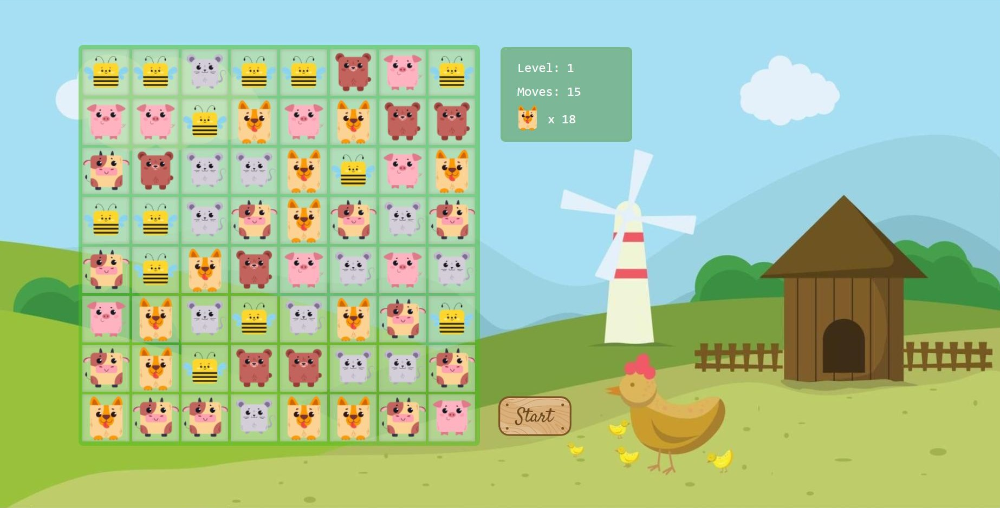

# candy-crush
A simple game inspired by Candy Crush made using JavaScript, CSS and HTML. More features in progress.
# Gameplay screenshot

# Setup
Download the project and open index.html

# How to play
Drag and drop the elements to switch their positions in order to match 3 or more in a row or column

# Credits
The base game was created by coding along [@kubowania] (https://www.github.com/kubowania) 's YouTube tutorial. You can find it here: https://youtu.be/XD5sZWxwJUk
